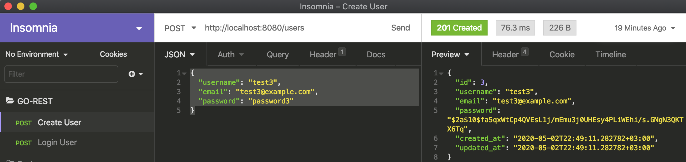

# REST API IN GO

## Set Up
1. $ brew install go
1. $ git clone "git@github.com:danmbeyah/GO-REST-API.git"

## How to run
$ go run main.go

API is accessible at http://localhost:8080

## Endpoints
1. http://localhost:8080/users  Actions: [POST/GET/PUT/DELETE] Body: {"username": "test3","email": "test3@example.com","password": "password3"}
1. http://localhost:8080/login  Actions: [POST] Body: {"email": "test3@example.com","password": "password3"}

## Example

## Tests
1. To run individual test

`go test --run TestGetUserByID` or `go test -v --run TestGetUserByID`

